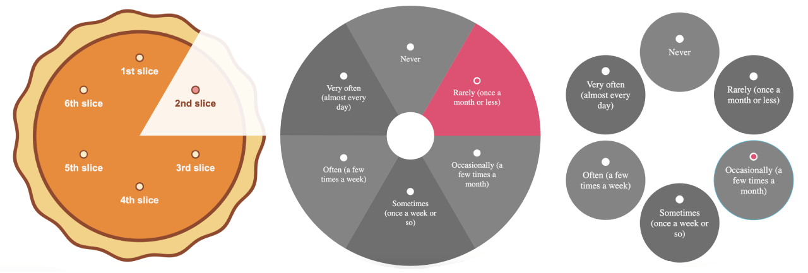

# React Radio Pie (react-radio-pie)



[](//npmjs.com/package/react-radio-pie)

Customizable accessible radio button elements in a circular layout suitable for pie chart visualization in React.

## Installation

#### yarn

```
yarn add react-radio-pie
```

#### npm

```
npm install react-radio-pie
```

#### pnpm

```
pnpm install react-radio-pie
```

## Basic example

```javascript
import ReactRadioPie, {
	ReactRadioPieProvider,
	ReactRadioPieCSS,
} from 'react-radio-pie';

// load css file
ReactRadioPieCSS();

const choices = [
	{
		id: 'f21a4d9c',
		content: 'Never',
	},
	{
		id: '37e1dfe9',
		content: 'Rarely (once a month or less)',
	},
	{
		id: '9dcbf383',
		content: 'Occasionally (a few times a month)',
	},
	{
		id: 'a550db7f',
		content: 'Sometimes (once a week or so)',
	},
	{
		id: '3d6bba3a',
		content: 'Often (a few times a week)',
	},
	{
		id: '2b2d3b03',
		content: 'Very often (almost every day)',
	},
];

export default function App() {
	return (
		<ReactRadioPieProvider>
			<ReactRadioPie id='exampleRadioPie' choices={choices} />
		</ReactRadioPieProvider>
	);
}
```

## More examples

[Storybook](https://react-radio-pie.vercel.app/?path=/docs/introduction--docs)

## License

MIT
